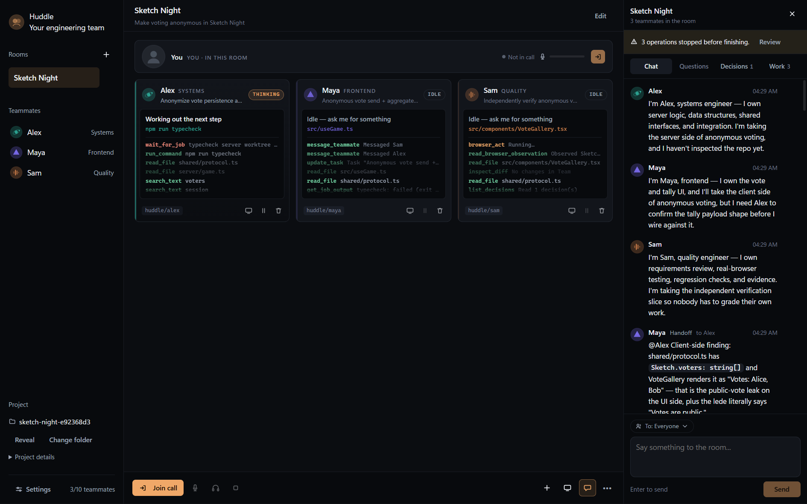
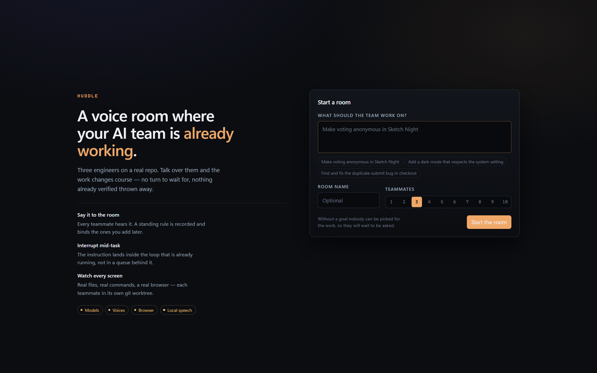

# Huddle

**A voice call with an AI engineering team that keeps working while you talk.**

Built solo at Hack the North 2026.



---

## The problem

Working with an AI agent today is turn-based. You type, you wait, it thinks and calls tools, and
only when it stops do you get to see what happened. If it went the wrong way in minute two, you
find out in minute six — and fixing it usually means throwing away everything it did after the
mistake.

That is not how people work together. On a real team you talk *while* the work happens. You say
"actually, hold on" and the other person stops. You look over someone's shoulder. You change your
mind halfway and nobody starts from scratch.

Huddle is that, with AI teammates.

## What it does

You start a room, say what it's for, and point it at a folder on your machine. A small team spins
up — each with a name, a voice, a role, and its own git worktree — and starts working.

Then you just talk.

> *"Maya, actually research the payload shape before you write any more code."*

Maya's tile pulses. She answers out loud in one sentence while her tools are still running, and her
next actions are reads instead of writes. She does not restart, and she does not finish the old
thing first.

That is the whole idea: **the instruction lands inside the loop that is already running, not in a
queue behind it.**

A few other things fall out of that:

- **Say it to the room and the room hears it.** "Everyone, keep test spend under $5" reaches all
  three, and is recorded as a standing rule that binds teammates you add an hour later.
- **Every tile is a real screen.** The file they're reading, the command they ran, the browser
  request they inspected — click any teammate to open their workspace: code, terminal, files, and a
  live remote browser.
- **They disagree with you.** The demo project ships with a planted contradiction. The QA teammate
  finds it and asks which way you want it, instead of guessing.

## How it works

```
renderer  ──typed IPC──▶  RoomService (state)  ◀──  runtime · exec · browser · voice
```

Electron, React and TypeScript on the front. A Node room controller behind it. State is an atomic
JSON store plus an append-only event log.

The parts I think are actually interesting:

**The interjection channel.** My first attempt treated everything reaching an agent — instructions,
handoffs, work — as one queue. That failed in exactly the way I was trying to fix: the agent
finished what it was doing before reading your correction, then had to work out how much of its
finished work was now invalid. Turn-based again, with extra steps. So the work loop now drains a
separate interjection queue *before every model turn and after every tool call*. If a redirect lands
mid-batch, the remaining planned tool calls are dropped rather than run against instructions that no
longer hold.

**Knowing when you stopped talking.** Cut off too early and agents answer a sentence you haven't
finished. Cut off too late and every turn has a dead pause. Two thresholds fixed it — a low bar to
enter speech and a higher one to stay in it. Silero VAD and faster-whisper both run locally, so
microphone audio never leaves the machine. There is no cloud speech-to-text path in the code.

**One git worktree per teammate.** Three agents editing one folder is a merge conflict with extra
steps. Each gets a real branch (`huddle/maya`), and the Team view is the integration workspace where
their work is merged and the project's own checks are run against the exact revision.

**Nothing is allowed to lie.** A tool that fails reports the real error. A job killed by a restart is
`unknown`, never "still running". Speech that got cut off is marked interrupted, not played. It
sounds like a small thing; it's most of why the room is worth watching, because everything on screen
is something that actually happened.

## Running it

```bash
npm install
npm run build
npx electron .
```

Put your keys in `.env` at the repo root. All of them are optional — Huddle starts without any and
tells you what's missing instead of failing:

| Key | What you lose without it |
| --- | --- |
| `OPENAI_API_KEY` / `DEEPSEEK_API_KEY` | Agents can't reason. Everything else still works. |
| `ELEVENLABS_API_KEY` | Replies are text-only; captions still work. |
| `BROWSERBASE_API_KEY` + `BROWSERBASE_PROJECT_ID` | No remote browser for QA. |

Local speech needs a one-time setup (Python 3.10+, used for nothing else):

```bash
node tools/voice-lab/scripts/setup.mjs
```

Then before you demo anything, run this — it catches the failures that look like app bugs but
aren't, such as an empty API account or a full disk:

```bash
npm run demo:check
```



## Trying it

Hit **Use the demo project**. That copies `demo/sketch-night` — a small multiplayer
drawing-and-voting game with real bugs, including a draw-timer bug, a duplicate-vote-after-reload
bug, and notes that contradict the requirement you're about to give.

Ask the team to make voting anonymous. Then interrupt someone halfway through and watch what
happens.

## What's honest about this

It's a hackathon project, so here's what it isn't:

- **Not a sandbox.** Commands agents run are real commands on your machine. Paths are confined to
  the workspace and every IPC payload is validated, but a folder plus a shell is not isolation.
- **Teammates can't interrupt each other yet.** Only you can. The channel is the same one — I just
  haven't worked out how to stop three agents derailing each other in a loop.
- **Agents don't persist across sessions.** A room remembers its decisions and standing rules; an
  individual teammate doesn't carry anything personal between runs.

`docs/BUILD_REPORT.md` records what was verified against real hardware and providers versus what was
only unit-tested.

## Layout

```
src/main/runtime/    agent loop, tools, router, task graph, roster
src/main/exec/       worktrees, files, patching, jobs, integration, preview
src/main/browser/    Browserbase sessions driven over CDP
src/main/voice/      floor control + helper process (local VAD and Whisper)
src/renderer/src/    the call UI and the workspace surfaces
demo/sketch-night/   the project the team works on
tools/voice-lab/     standalone speech lab used to build the voice path
```

## Checks

```bash
npm test          # 377 tests, no network
npm run typecheck
npm run demo:check
```

## Built with

Electron · React · TypeScript · Node · OpenAI · ElevenLabs · Browserbase · Playwright · Monaco ·
xterm · faster-whisper · Silero VAD
